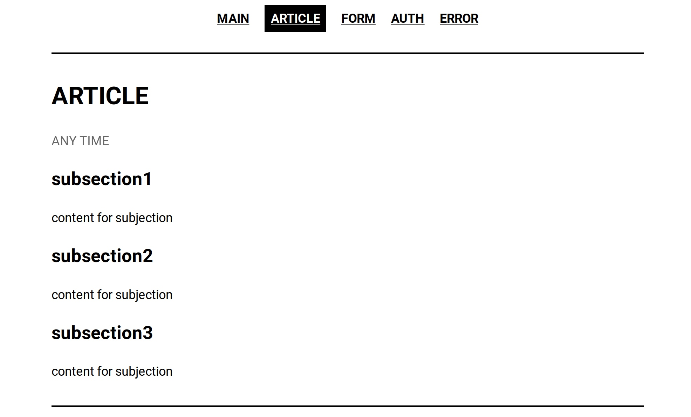
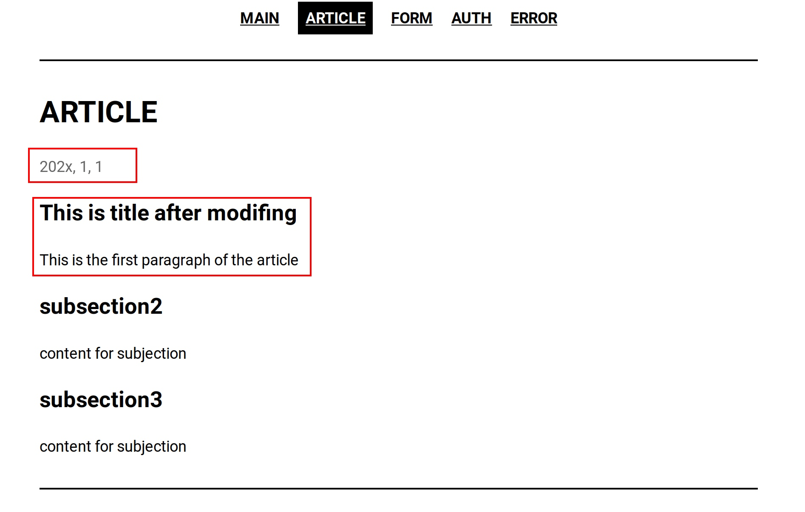

## 开发文档

### 0. 综述

此项目支持自定义多种数据库和不同界面。
数据库包括: `mysql`, `mssql`, `sqlite`; 
界面包括: `main`, `article`, `form`, `auth`, `error`,  `exception`. 

### 1. 主界面

#### 1.1 默认格式

下图展示主界面默认格式


我们支持一定程度的主界面配置，有关主界面的配置代码位于文件[app.py: L36-42](../app.py).  下列代码块也展示了相关代码：

```python
@app.route('/', methods=['GET'])
def department_main(): 
    return j2_env.get_template('index.jinja').render(
        theme_colour = 'black',
        sections = ['article', 'form', 'auth', 'error'], 
        department_name = 'this department'
    )
```

#### 1.2 自定义格式

主界面支持，修改界面主题色，导航栏和部门名称。其中前两种配置通用于其他所有界面，在之后章节中不再赘述。修改范例和效果如下: 


```python
@app.route('/', methods=['GET'])
def department_main(): 
    return j2_env.get_template('index.jinja').render(
        theme_colour = 'blue',
        sections = ['1', '2', '3', '4'], 
        department_name = 'SOME CHANGES'
    )
```

#### 2. 文章界面

#### 2.1 默认格式

下图展示文章界面默认格式, 



有关主界面的配置代码位于文件[app.py: L44-56](../app.py).  下列代码块也展示了相关代码：

```
@app.route('/article', methods=['GET'])
def test_article(): 
    return j2_env.get_template('section_article.jinja').render(
        theme_colour = 'black',
        sections = ['article', 'form', 'auth', 'error'], 
        section_name = 'article', 
        date_time = 'ANY TIME', 
        subsections = {
            'subsection1': 'content for subjection', 
            'subsection2': 'content for subjection', 
            'subsection3': 'content for subjection', 
        }
    )
```

#### 2.2 自定义格式

除通用配置，我们支持以列表的形式配置文章内容`subsections`和文章发布时间`date_time`
修改范例和效果如下: 



```python
@app.route('/article', methods=['GET'])
def test_article(): 
    return j2_env.get_template('section_article.jinja').render(
        theme_colour = 'black',
        sections = ['article', 'form', 'auth', 'error'], 
        section_name = 'article', 
        date_time = '202x, 1, 1', 
        subsections = {
            'This is title after modifing': 'This is the first paragraph of the article', 
            'subsection2': 'content for subjection', 
            'subsection3': 'content for subjection', 
        }
    )

```

### 3. 单输入框提交界面

#### 3.1 默认格式

下图展示单输入框提交界面默认格式, 


有关单输入框提交界面的配置代码位于文件[app.py: L58-67](../app.py).  下列代码块也展示了相关代码：

```
@app.route('/form', methods=['GET'])
def test_form(): 
    return j2_env.get_template('section_basic_form.jinja').render(
        theme_colour = 'black',
        sections = ['article', 'form', 'auth', 'error'], 
        section_name = 'form', 
        date_time = 'ANY TIME', 
        form = SearchForm(),
        submit_to = '/posted'
    )
```

#### 3.2 自定义格式

我们支持提交规则`submit_to`, 修改此代码将会修改post地址。

### 4. 登陆

#### 4.1 数据库

如果需要修改数据库配置请在文件[app.py: L23](../app.py)处修改方法`init_dbmanager`的传入参数。其中`db_uri`用于指定外部数据库地址，账户和密码。`init_json`用于初始化数据库内部数据。

```python
db_manager = db_utils.init_dbmanager(app, 
    db_uri = None, 
    init_json='[{"username": "root", "password":"123456789"}]'
)
```
对象`db_utils`还提供其他接口例如查询数据： 
* `db_utils.is_correct(username=?, password=?)` 用于验证用户密码账号是否匹配。

#### 4.2 登陆界面

请访问代码[app.py: L83-109](../app.py)。
我们通过对象`login_utils`来帮助我们管理登陆界面，
* `login_utils.UserSession(uname=?)`用于为当前用户创造会话，当成功创造会话后请调用`login_utils.login_user(user_session)` 此方法将会更新`current_user`用于后续操作。
* `login_utils.current_user` 用于获取当前登陆的用户`session`. 如果此数据空或属性`is_authenticated`为false表示用户为登陆。(此方法也可以用在任何界面)。`current_user`可以让我们访问用户保存在数据库中的信息。

