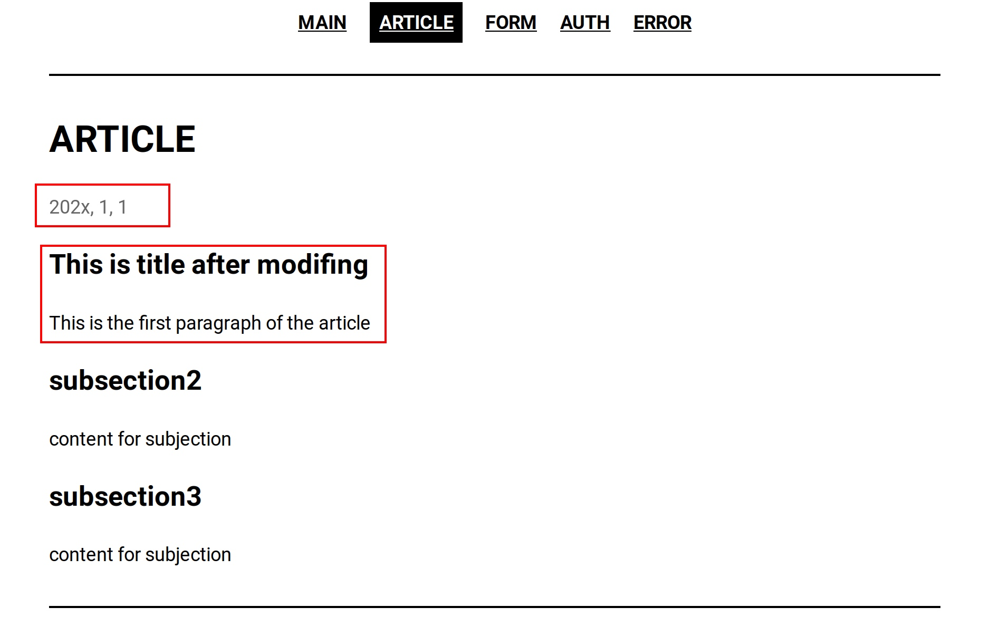

## Development documentation

### 0. Overview

This project supports customizing multiple databases and different interfaces.
Databases include: `mysql`, `mssql`, `sqlite`;
Interfaces include: `main`, `article`, `form`, `auth`, `error`, `exception`.

### 1. Main interface

#### 1.1 Default format

The following figure shows the default format of the main interface


We support a certain degree of main interface configuration. The configuration code for the main interface is located in the file [app.py: L36-42](../app.py). The following code block also shows the relevant code:

````python
@app.route('/', methods=['GET'])
def department_main():
    return j2_env.get_template('index.jinja').render(
        theme_colour = 'black',
        sections = ['article', 'form', 'auth', 'error'],
        department_name = 'this department'
    )
````

#### 1.2 Custom Format

Main interface support, modify interface theme color, navigation bar and department name. The first two configurations are common to all other interfaces and will not be repeated in subsequent chapters. Modification examples and effects are as follows:


````python
@app.route('/', methods=['GET'])
def department_main():
    return j2_env.get_template('index.jinja').render(
        theme_colour = 'blue',
        sections = ['1', '2', '3', '4'],
        department_name = 'SOME CHANGES'
    )
````

#### 2. Article interface

#### 2.1 Default format

The following figure shows the default format of the article interface,


The configuration code for the main interface is located in the file [app.py: L44-56](../app.py). The following code block also shows the relevant code:

````
@app.route('/article', methods=['GET'])
def test_article():
    return j2_env.get_template('section_article.jinja').render(
        theme_colour = 'black',
        sections = ['article', 'form', 'auth', 'error'],
        section_name = 'article',
        date_time = 'ANY TIME',
        subsections = {
            'subsection1': 'content for subjection',
            'subsection2': 'content for subjection',
            'subsection3': 'content for subjection',
        }
    )
````

#### 2.2 Custom format

In addition to the general configuration, we support configuring the article content `subsections` and the article publishing time `date_time` in the form of a list
Modification examples and effects are as follows:



```python
@app.route('/article', methods=['GET'])
def test_article(): 
    return j2_env.get_template('section_article.jinja').render(
        theme_colour = 'black',
        sections = ['article', 'form', 'auth', 'error'], 
        section_name = 'article', 
        date_time = '202x, 1, 1', 
        subsections = {
            'This is title after modifing': 'This is the first paragraph of the article', 
            'subsection2': 'content for subjection', 
            'subsection3': 'content for subjection', 
        }
    )

```

### 3. Single input box submission interface

#### 3.1 Default format

The following figure shows the default format of the single input box submission interface,


The configuration code for the single input box submission interface is located in the file [app.py: L58-67](../app.py). The following code block also shows the relevant code:

````
@app.route('/form', methods=['GET'])
def test_form():
    return j2_env.get_template('section_basic_form.jinja').render(
        theme_colour = 'black',
        sections = ['article', 'form', 'auth', 'error'],
        section_name = 'form',
        date_time = 'ANY TIME',
        form = SearchForm(),
        submit_to = '/posted'
    )
````

#### 3.2 Custom Format

We support the submission rule `submit_to`, modifying this code will modify the post address.

### 4. Login

#### 4.1 Database

If you need to modify the database configuration, please modify the incoming parameters of the method `init_dbmanager` in the file [app.py: L23](../app.py). Where `db_uri` is used to specify the external database address, account and password. `init_json` is used to initialize database internal data.

````python
db_manager = db_utils.init_dbmanager(app,
    db_uri = None,
    init_json='[{"username": "root", "password":"123456789"}]'
)
````
The object `db_utils` also provides other interfaces such as querying data:
* `db_utils.is_correct(username=?, password=?)` is used to verify whether the user password account matches.

#### 4.2 Login interface

Please visit the code [app.py: L83-109](../app.py).
We use the object `login_utils` to help us manage the login interface,
* `login_utils.UserSession(uname=?)` is used to create a session for the current user. When the session is successfully created, please call `login_utils.login_user(user_session)` This method will update `current_user` for subsequent operations.
* `login_utils.current_user` is used to get the currently logged in user `session`. If this data is empty or the attribute `is_authenticated` is false, it means the user is logged in. (This method can also be used in any interface). `current_user` gives us access to the user's information stored in the database.
